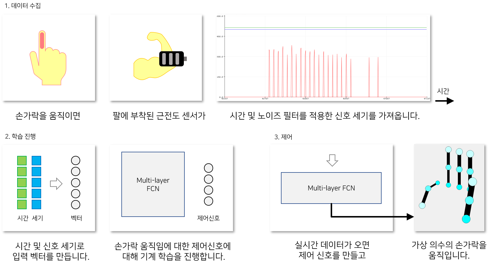
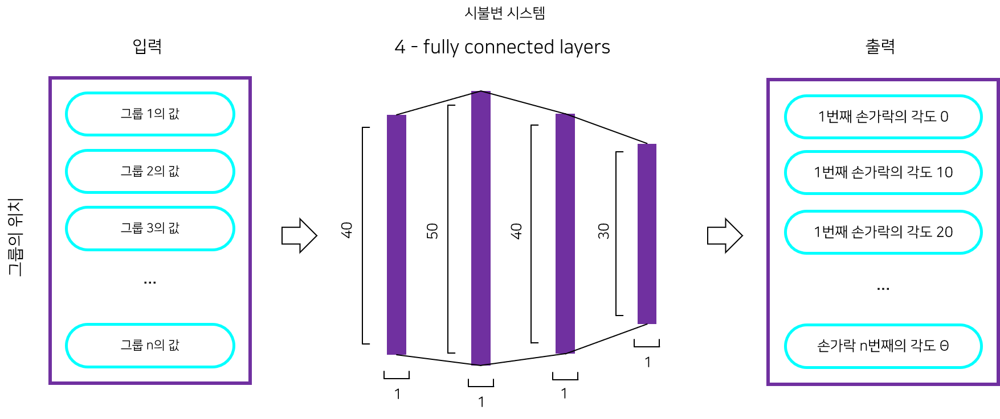
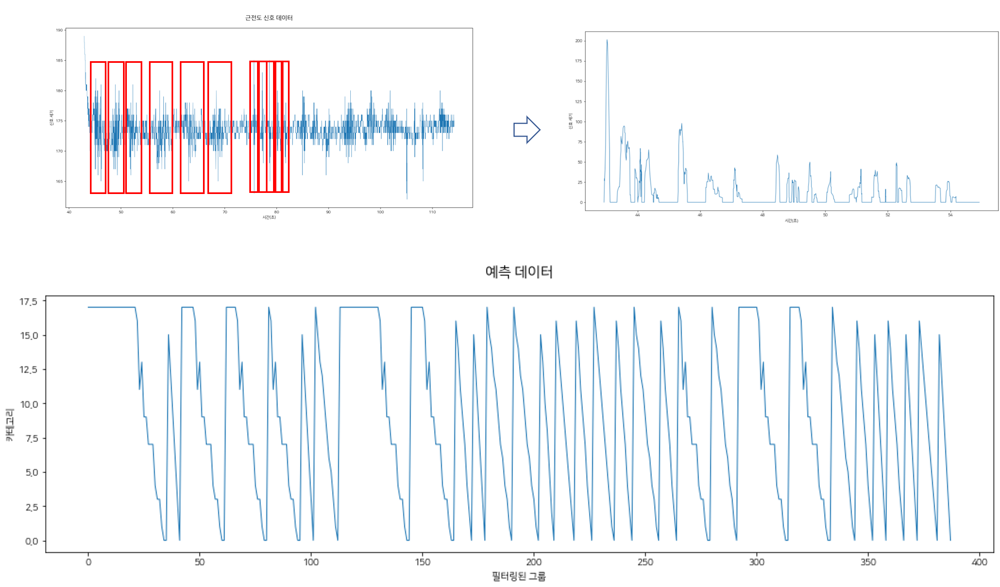

# DoTheEHands

##### Sencing real sEMG and Simulating electronichands for capstone project

---

### Dependencies

EMGFilters : https://github.com/oymotion/EMGFilters

tensorflow : https://github.com/tensorflow/tensorflow

keras : https://github.com/keras-team/keras

pyserial : https://github.com/pyserial/pyserial

numpy : https://github.com/numpy/numpy

matplotlib : https://github.com/matplotlib/matplotlib

---

### Project

This project take a 3-parts

##### Filtering formula from sensing

* Periodic convolution products and step summations

* 4 - Fully Connected Layers (4-FCN), Time-invariant system

Sensing : ./sensing/sketch_apr18a/sketch_apr18a.ino

Learning : ./SignalAnalyzer.py

Simulating : ./SignalGenerator.py

---

### Results

Intel(R) Core(TM) i5-6200U CPU @ 2.30GHz, RAM 8GB

500 times, 43 seconds learning, accuracy : 62.89%

---

### Movies

##### Here is simulating movies.

Sencing the fore-finger by sEMG sensor. : https://youtu.be/aGWyPK3b4c4

Simulating the GUI Bionics hands : https://youtu.be/-1GeHx-WVl4